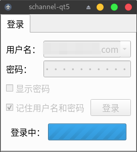
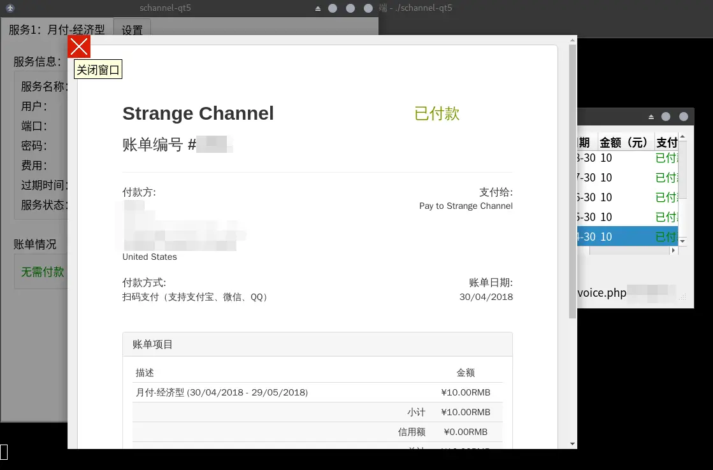
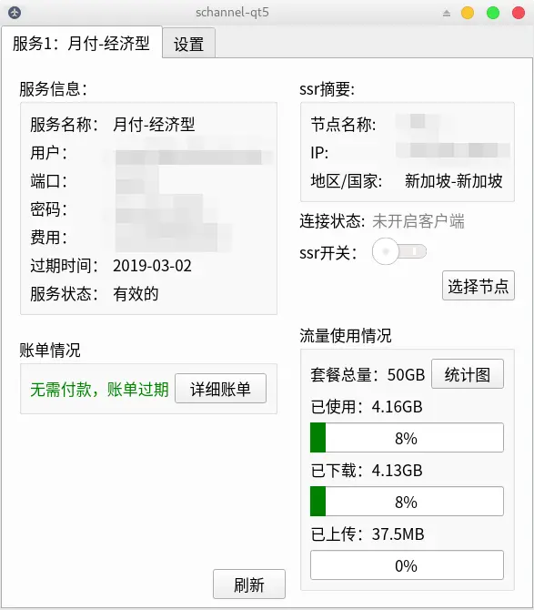
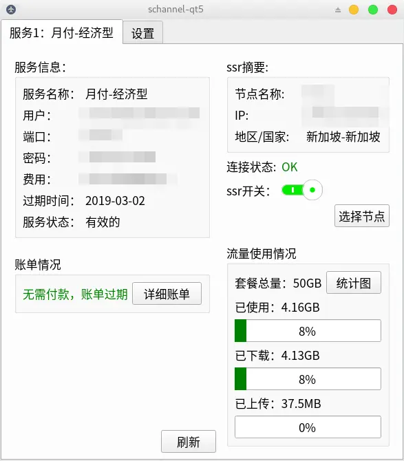

## schannel-qt5
A QT based GUI client for [schannel](https://schannel.net/) - written in Golang

### Features:
- clear data usage display
- quickly view service information
- supports lots of user settings
- simply & easy to use
- freely configure the ssr client program
- use charts to show data more clearly

### Installation
At first we need to install [therecipe/qt](https://github.com/therecipe/qt)

Then:
```bash
go get -u github.com/astaxie/beego/orm
go get -u github.com/mattn/go-sqlite3
go get -u github.com/PuerkitoBio/goquery
cd $GOPATH/src
git clone 'https://github.com/apocelipes/schannel-qt5'
# install country flags info
git clone 'https://github.com/matiassingers/emoji-flags' schannel-qt5/emoji-flags
cd schannel-qt5/widgets
qtmoc && qtrcc
cd .. && go build
```

Note that schannel-qt5 needs golang >= go1.12.

Because of the flaw in QFont on x11, schannel-qt5 can't set its own font without fontconfig, so you need to install the font "NotoColorEmoji" to support emoji.

Now you can enjoy schannel-qt5!

### Screenshots
login:


logging:



invoices view:




select nodes:


service info & client switch:





user settings:


data charts:


### important configurations:
- `ssrclient.json`: Configure the behavior of the ssr client.
- `~/.local/share/schannel-qt5.json`: Configure the behavior of the schannel-qt5.
- `~/.local/share/schannel-users.db`: Store encrypted user information and traffic usage records (traffic records for chart display).
- `~/.local/share/data/schannel-qt5/GeoIP/`: Store the GeoIP database.

### Todo:
- support system tray icon
- more clearly document
- more tests

Welcome feedback questions and submit PRs,

I am looking forward to working with you.
