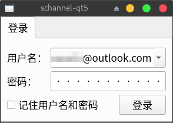
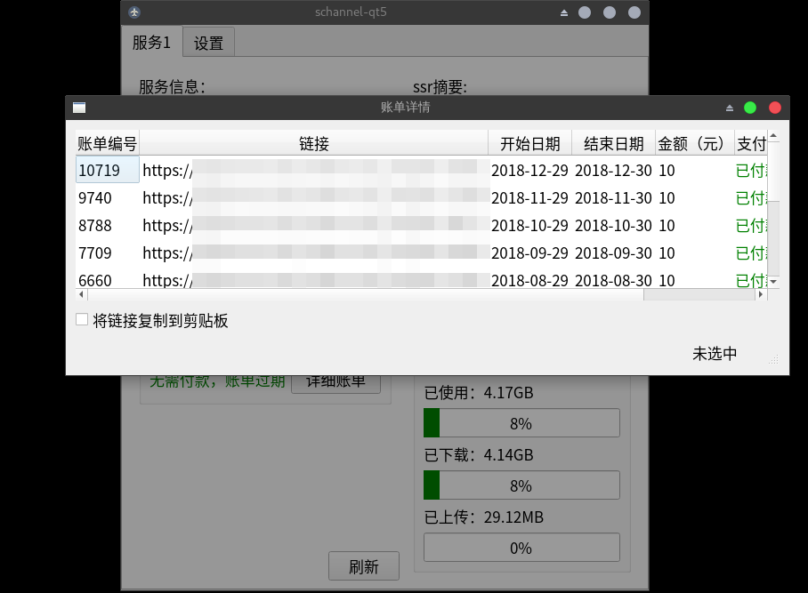
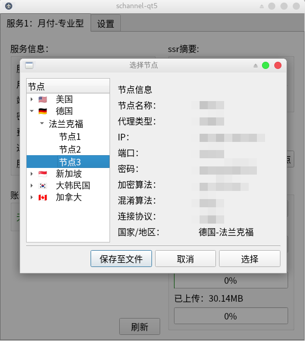
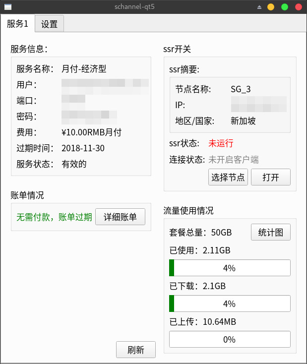
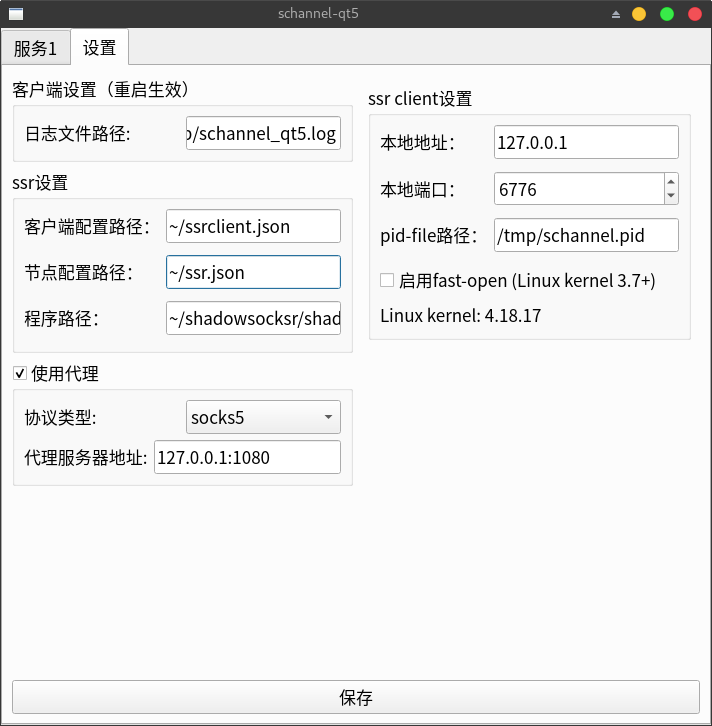
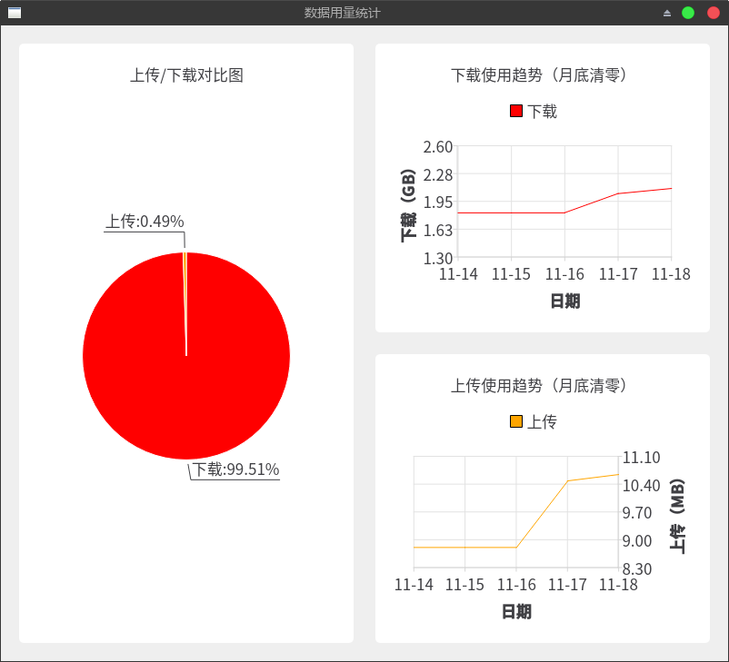

## schannel-qt5
A QT based GUI client for [schannel](https://schannel.net/) - written in Golang

### Features:
- clear data usage display
- quickly view service information
- supports lots of user settings
- simply & easy to use
- freely configure the ssr client program
- use charts to show data more clearly

### Installation
At first we need to install [thetheripe/qt](https://github.com/therecipe/qt)

Then:
```bash
go get -u github.com/astaxie/beego/orm
go get -u github.com/mattn/go-sqlite3
go get -u github.com/PuerkitoBio/goquery
cd $GOPATH/src
git clone 'https://github.com/apocelipes/schannel-qt5'
cd schannel-qt5/widgets && qtmoc
cd .. && go build
```

Now you can enjoy schannel-qt5!

### Screenshots
login:



invoices view:



select nodes:



service info & client switch:



user settings:



data charts:



### Todo:
- add dialog to confirm whether to save the configuration
- support system tray
- more clearly document
- more tests

Welcome feedback questions and submit PRs,

I am looking forward to working with you.